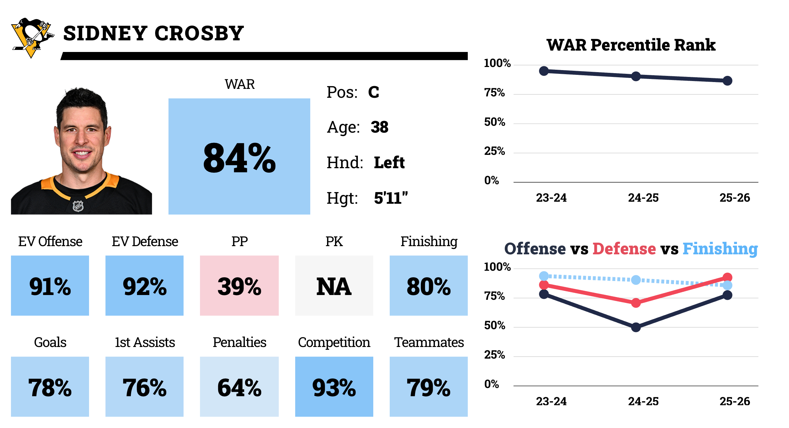
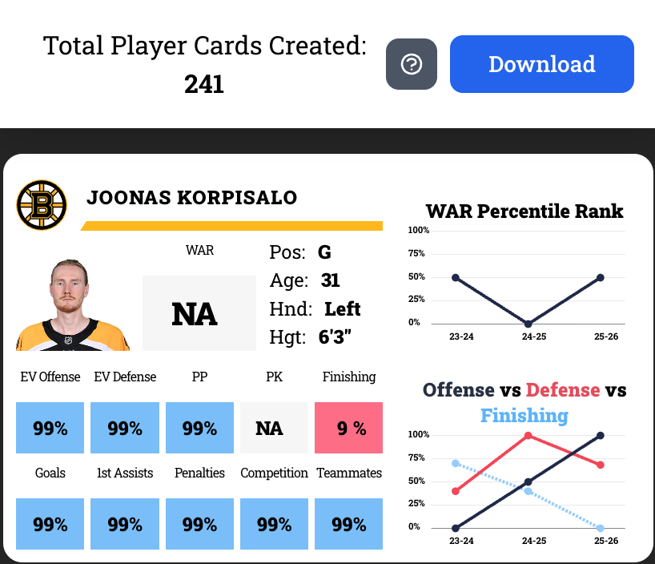
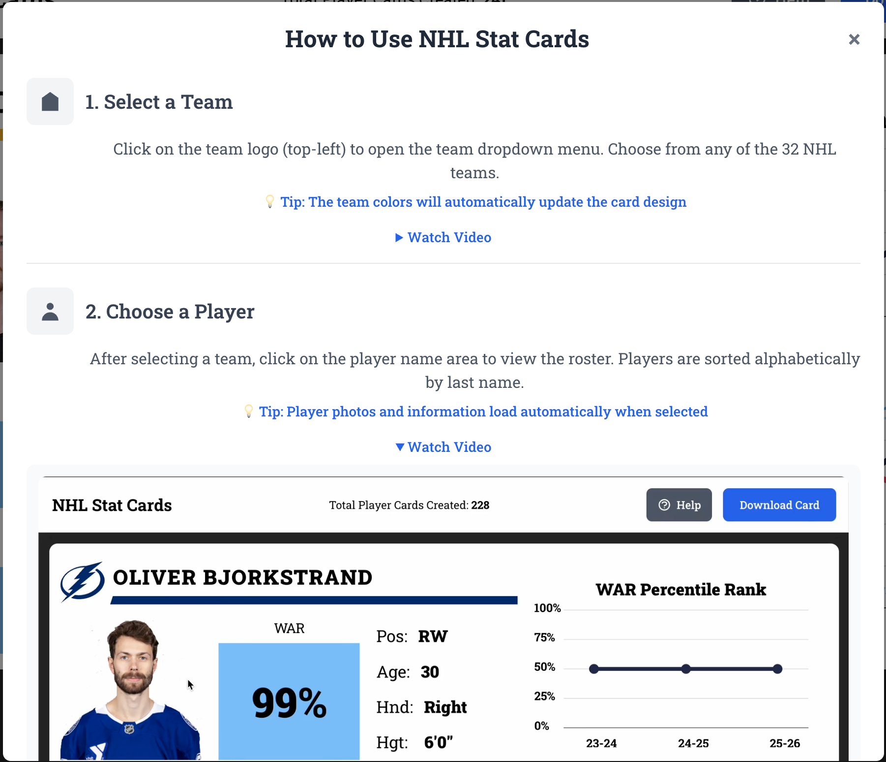

# 🏒 [NHL Stat Cards](https://github.com/Damon-Thomas/NHL-Stat-Cards)

A modern, interactive web application for creating and downloading custom NHL player stat cards. Built with React, TypeScript, and powered by real-time NHL API data.



## 🌟 Features

### Core Functionality

- **Interactive Player Cards**: Select any NHL team and player to generate custom stat cards
- **Real-time Data**: Fetches live team rosters and standings from the official NHL API
- **Customizable Stats**: Edit player statistics with an intuitive interface
- **Visual Analytics**: Dynamic line graphs showing WAR percentile ranks and performance metrics
- **Download Capability**: Export high-quality PNG images of player cards
- **Team Branding**: Dynamic team colors and logos for authentic visual design

### Advanced Features

- **Responsive Design**: Optimized for desktop, tablet, and mobile devices
- **Help System**: Interactive tutorial with video demonstrations
- **Usage Analytics**: Track total cards created across all users
- **Rate Limiting**: Fraud protection and API abuse prevention
- **Image Proxy**: Secure handling of external NHL player images

## 📱 Screenshots

### Main Interface


### Mobile Experience



### Help System



## 🚀 Getting Started

### Prerequisites

- **Node.js** (v18 or higher)
- **pnpm** package manager
- **Upstash Redis** account (for analytics and rate limiting)

### Installation

1. **Clone the repository**

   ```bash
   git clone git@github.com:Damon-Thomas/NHL-Stat-Cards.git
   cd NHL-Stat-Cards
   ```

2. **Install dependencies**

   ```bash
   pnpm install
   ```

3. **Set up environment variables**

   Create a `.env.local` file in the root directory:

   ```env
   # Required for production
   UPSTASH_REDIS_REST_URL=https://your-redis-url.upstash.io
   UPSTASH_REDIS_REST_TOKEN=your-redis-token

   # Optional
   PRODUCTION_URL=https://your-domain.com
   ```

4. **Start the development server**

   ```bash
   pnpm dev
   ```

5. **Open your browser**

   Navigate to `http://localhost:5173`

## 🏗️ Project Structure

```
NHL-Stat-Cards/
├── api/                    # Serverless API functions
│   ├── get-teams.ts       # Fetch NHL team standings
│   ├── get-roster.ts      # Fetch team rosters
│   ├── get-count.ts       # Get usage analytics
│   ├── increment.ts       # Track card creation
│   ├── image-proxy.ts     # Secure image proxy
│   └── utils/             # Shared utilities
│       ├── security.ts    # Security middleware
│       └── env.ts         # Environment validation
├── src/
│   ├── components/        # React components
│   │   ├── PlayerCard.tsx # Main card component
│   │   ├── LineGraph.tsx  # Data visualization
│   │   ├── StatBox.tsx    # Editable stat inputs
│   │   └── ...
│   ├── contexts/          # React context providers
│   │   ├── playerContext.tsx
│   │   ├── statContext.tsx
│   │   └── graphContext.tsx
│   ├── utils/             # Frontend utilities
│   │   ├── teamLogos.ts   # Team logo mappings
│   │   ├── imageProxy.ts  # Image handling
│   │   └── colorInterpolation.ts
│   └── data/
│       └── colors.ts      # Team color schemes
└── public/
    ├── favicon_io/           # Favicon files generated by favicon.io
    ├── logos/nhl/         # Team logo assets
    ├── videos/            # Help tutorial videos
    ├── screenshots/       # Application screenshots
    └── Roboto_Slab/       # Custom font files
```

## 🔧 Technical Stack

### Frontend

- **React 19** - Modern UI framework with latest features
- **TypeScript 5.8** - Type-safe development
- **Vite 7** - Fast build tool and dev server
- **Tailwind CSS 3.4** - Utility-first styling
- **[Modern Screenshot](https://github.com/qq15725/modern-screenshot)** - High-quality image generation

### Backend

- **Vercel Functions** - Serverless API endpoints
- **Upstash Redis** - Analytics and rate limiting
- **NHL API** - Official data source

### Security & Performance

- **Rate Limiting** - IP-based request throttling
- **CORS Protection** - Secure cross-origin requests
- **Input Validation** - Comprehensive data sanitization
- **SSRF Protection** - Secure image proxy implementation

## 🎯 Design Decisions

### Architecture Choices

**1. Component-Based Architecture**

- Modular React components for maintainability
- Context API for state management across components
- Custom hooks for data fetching and state logic

**2. Serverless-First Approach**

- Vercel Functions for scalable API endpoints
- No server maintenance overhead
- Automatic scaling based on demand

**3. Security-Focused Design**

- Comprehensive input validation
- Rate limiting to prevent abuse
- Secure image proxy to prevent SSRF attacks
- No sensitive data exposure in error messages

### UI/UX Decisions

**1. Team-Centric Branding**

- Dynamic colors based on selected team
- Authentic NHL team logos and styling
- Consistent visual identity

**2. Progressive Enhancement**

- Mobile-first responsive design
- Graceful degradation for older browsers
- Accessible keyboard navigation

**3. Performance Optimization**

- Lazy loading for images
- Optimistic UI updates
- Efficient state management

## 🚧 Challenges Faced & Solutions

### 1. **NHL API Integration**

**Challenge**: Inconsistent API response structures and rate limiting
**Solution**:

- Implemented robust error handling and retry logic
- Created flexible data parsing for different API response formats
- Added caching layer to reduce API calls

### 2. **Image Generation & CORS**

**Challenge**: Browser security restrictions for downloading canvas-based images
**Solution**:

- Implemented secure image proxy for NHL player photos
- Used modern-screenshot library for reliable image generation
- Created hidden fixed-size card for consistent downloads

### 3. **Real-time Data Consistency**

**Challenge**: Managing state across multiple components with async data
**Solution**:

- React Context API for centralized state management
- Custom hooks for data fetching logic
- Optimistic UI updates for better user experience

### 4. **Security & Rate Limiting**

**Challenge**: Preventing API abuse and protecting serverless functions
**Solution**:

- IP-based rate limiting with Redis
- Comprehensive input validation
- CORS protection and security headers

### 5. **Performance Optimization**

**Challenge**: Large team logo assets and responsive design
**Solution**:

- Optimized asset delivery
- Lazy loading implementation
- Responsive image sizing

## 🔒 Security Features

- **Rate Limiting**: 60 requests/minute for GET, 30/minute for POST, 10/minute for increment operations
- **Input Validation**: Strict validation for team IDs, URLs, and user inputs
- **CORS Protection**: Configurable origin allowlists
- **SSRF Prevention**: Whitelist-only image proxy for NHL assets
- **Security Headers**: Comprehensive security header implementation

## 📊 Analytics

The application tracks anonymous usage statistics:

- Total cards created across all users
- Rate limiting metrics
- API endpoint usage

No personal data is collected or stored.

## 🚀 Deployment

### Vercel (Recommended)

1. **Connect your repository to Vercel**
2. **Set environment variables** in Vercel dashboard
3. **Deploy automatically** on every push to main branch

### Environment Variables for Production

```env
UPSTASH_REDIS_REST_URL=https://your-redis-url.upstash.io
UPSTASH_REDIS_REST_TOKEN=your-redis-token
PRODUCTION_URL=https://your-domain.com
```

## 🛠️ Development

### Available Scripts

- `pnpm dev` - Start development server
- `pnpm build` - Build for production
- `pnpm preview` - Preview production build
- `pnpm lint` - Run ESLint

### API Endpoints

- `GET /api/get-teams` - Fetch NHL team standings
- `GET /api/get-roster?teamId=TOR` - Fetch team roster
- `GET /api/get-count` - Get total cards created
- `POST /api/increment` - Increment card creation counter
- `GET /api/image-proxy?url=...` - Proxy NHL player images

## 🤝 Contributing

1. Fork the repository
2. Create a feature branch (`git checkout -b feature/amazing-feature`)
3. Commit your changes (`git commit -m 'Add amazing feature'`)
4. Push to the branch (`git push origin feature/amazing-feature`)
5. Open a Pull Request

## 📄 License

This project is licensed under the MIT License

## 🙏 Acknowledgments

- **NHL** for providing the official API
- **React Team** for the amazing framework
- **Vercel** for excellent serverless platform
- **Upstash** for Redis hosting

## 📧 Contact

For questions or support, please open an issue on GitHub.

---

**Built with ❤️ for hockey fans everywhere**
